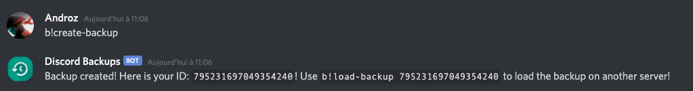
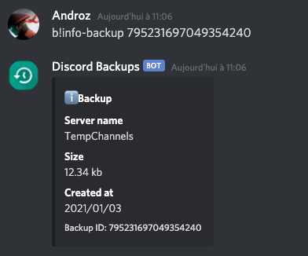
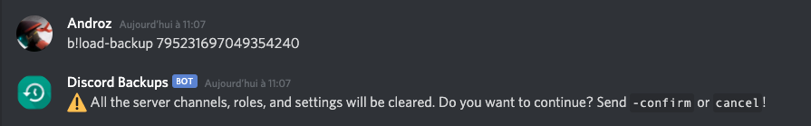

# Backups Bot

🌀 Backups Bot using the discord-backup package!

## Features

* `create-backup` command
* `load-backup` command
* `info-backup` command

### Create

This command allows you to create a backup of the current server (restricted to moderators)

  

### Info

This command allows you to get information about the backup you created



### Load

This command allows you to load a backup in the current server (restricted to administrators)

  

## Install

* Clone repository

```sh
git clone https://github.com/Androz2091/backups-bot
```

* Fill configuration (config.json)

> Head to https://discord.com/developers/applications and create an application to obtain your bot token.

```json
{
    "token": "Your Discord Bot token",
    "prefix": "b!"
}
```

* Install dependencies

```sh
npm install
```

* Start

```sh
node index.js
```
